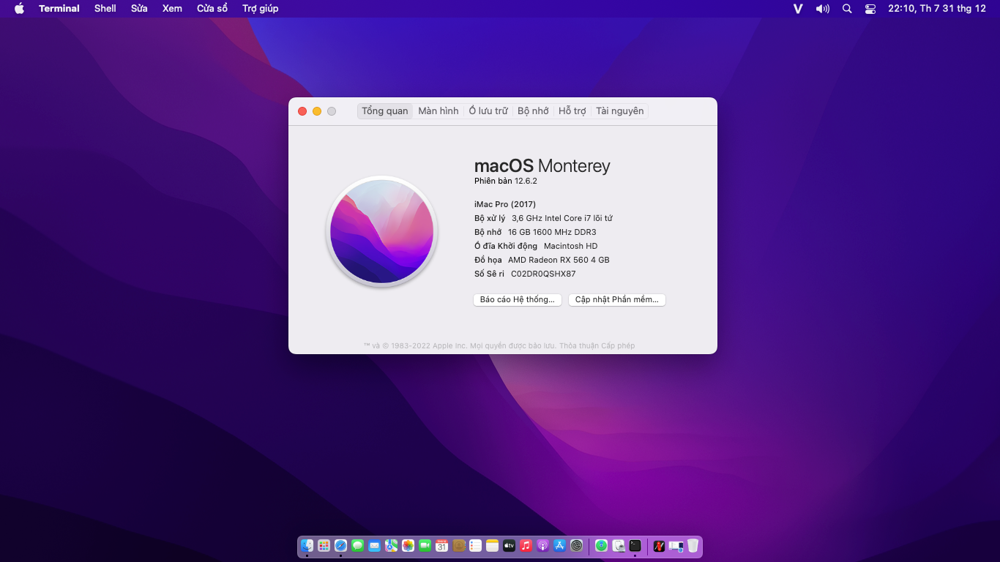

# 
Asus H81MD Hackintosh
 

## Intro

| | Version |
|-|---------|
| OpenCore | 0.8.5 |
| macOS | Monterey 12.6.2 |

## Laptop Specification

|                     | Specifications| Note |
| ---------------------------- | ---------------------- |------------------|
| ``Chipset``| Intel Lynx Point |   |
| ``CPU``| Intel Core i7-4790 3.60GHz |  |
| ``Memory``| 16GB DDR3-1600MHz |  |
| ``iGPU``| Intel HD Graphics 4600 |  |
| ``dGPU``| AMD Radeon RX 560 4 GB |  |
| ``Disk``| KINGSTON SA400S37120G |  |
| ``Screen``| 14.0" 1366 x 768 |    |
| ``Ethernet``| RTL8111/8168/8411 PCI Express Gigabit Ethernet Controller | Use [RealtekRTL8111](https://github.com/Mieze/RTL8111_driver_for_OS_X/releases). |
| ``Audio``| ALC887 | Add `alcid=7` to boot-arg or add layout-id to DeviceProperties. |
| ``Keyboard``| - |  |

## Features

| ``Features``|``Working``| 
|-------------|-----------|
| ``Audio``|✅|
| ``Keyboard and Trackpad``|✅|
| ``Headphone Jack``|✅|
| ``Graphics``|✅|
| ``Power Management``|✅|                                                                        
| ``USB Port``|✅|
| ``Facetime and iMessage``|✅|
| ``Ethernet``|✅|
| ``Sleep``|✅|